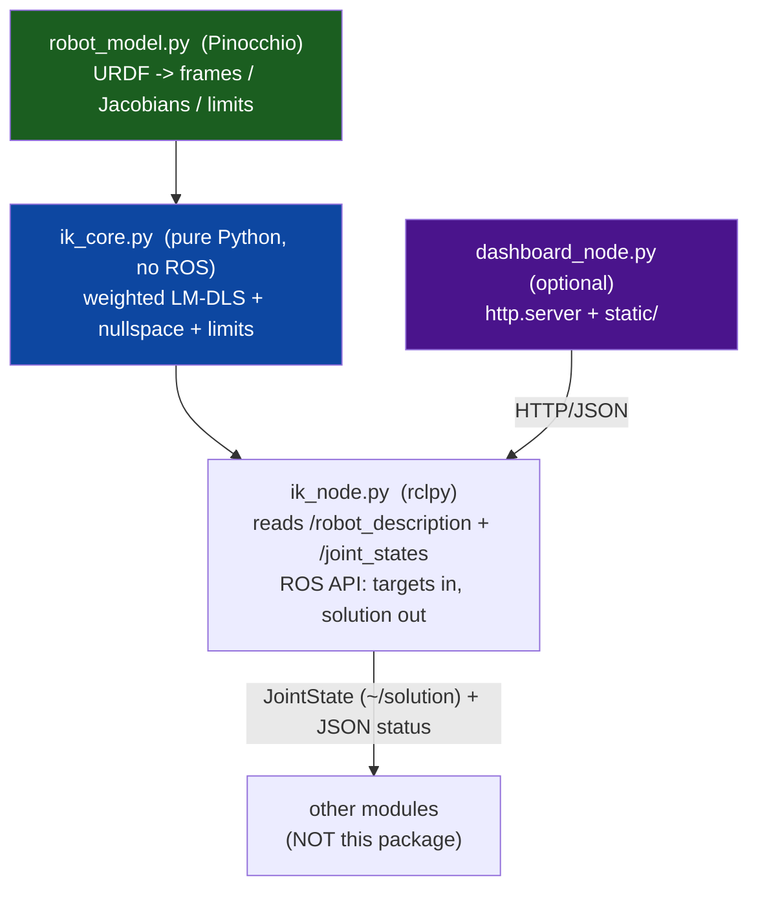

# `ikt_inverse_kinematics` — Implementation Plan

> Status: **IMPLEMENTED** — this was the original build spec (design session
> 2026-06-11); the package it describes now exists and ships. Kept only for
> **design rationale** (the R1–R9 / E1–E4 feature reasoning). For what actually
> exists and how to run it, read [`README.md`](README.md). NOTE: paths below
> reference the old `cartesian_controllers_toolkit` location; the code now lives
> in the `inverse_kinematics_toolkit` submodule.
>
> Author of plan: design session 2026-06-11.

---

## 1. Purpose & scope

`ikt_inverse_kinematics` is a **robot-agnostic inverse-kinematics service**. Given a
URDF (read live from ROS 2) it solves, for one or more chosen links, the joint
angles that place those links at requested target poses — subject to joint
limits, singularity robustness, a soft "prefer zero / rest posture" bias, and
**per-DOF task stiffness** that trades off how hard each Cartesian DOF is pushed
toward its target.

**This package does NOT command the robot.** It is a pure *solver*: it ingests
targets and publishes IK *results* (joint-angle solutions + diagnostics). Other
modules (a trajectory controller, the FZI cartesian stack, a teleop relay, etc.)
decide whether and how to actuate. This separation is deliberate and mirrors the
toolkit convention that the dashboard/solver layers never touch hardware directly.

### Core requirements (R1–R5, from the user)

1. **Pose → joints for an arbitrary link.** The operated link need *not* be the
   last link of a chain, and the robot may have **multiple tips** (e.g. a dual-arm
   robot — `right_arm_Link7` and `left_arm_Link7`). Support solving one or several
   link-targets simultaneously.
2. **Virtual links / tool frames.** Allow attaching a 6-DOF offset to an existing
   link (or a physically added link) and solving on that virtual frame, to
   simulate the robot holding a tool. Reuse `ikt_common.urdf_loader.augment_urdf`.
3. **Constraints.** Hard joint position limits, singularity robustness (damping),
   and a **soft preference for each joint to sit near 0 rad** (configurable rest
   posture).
4. **Per-DOF stiffness.** The user supplies a stiffness per task DOF = "how hard to
   push toward this component of the target." Low orientation stiffness ⇒ the
   solver prioritises *position*; high stiffness ⇒ the solver works harder (and
   tolerates larger / more coordinated joint motion) to hit that DOF. This is the
   knob that prevents *unwanted severe rotations* when a DOF is not important.
5. **Optional dashboard.** A web UI to enter targets, move stiffness sliders, and
   monitor solutions / residuals / limit-proximity / manipulability. **The package
   must run fully headless without the dashboard.**

### Value-add features fused into the core (R6–R9, added 2026-06-11)

These are cheap to build on the Pinocchio backend, define the package's identity
for *this* robot (dual-arm, 7-DOF redundant, force-control), and double as the
learning sandbox for the deferred FZI null-space fix. Treat them as first-class,
not optional.

6. **Arm-angle / null-space parametrization (the redundancy knob).** For a 7-DOF
   S-R-S arm the Jacobian null space is 1-D — the elbow *swivel* (arm angle ψ).
   *Report* the current ψ per chain in `~/status`, and *accept* a desired ψ as a
   soft task so the redundant DOF is **controllable, not incidental**. This is the
   explicit bridge to the FZI `ForwardDynamicsSolver` null-space fix (see
   `force_control_setup.md`): prototype + validate posture/arm-angle resolution
   here in Python, then port the proven law into the C++ solver. Serves both user
   goals ("control with pose" + "get more knowledge about IK").
7. **Reachability verdict + closest-reachable pose.** On failure, don't just return
   a large residual: return `reachable: false`, the nearest achievable pose, and
   *why* (which joint hit a limit / near-singular / task conflict). Essential UX
   for any pose-control consumer asking "why didn't it go there?".
8. **TF-framed targets.** Accept a target `PoseStamped` in *any* frame (camera,
   object, table) and transform it into the solve/base frame via tf2. Without this
   every consumer reimplements frame math.
9. **Dual-arm coordination constraint (relative pose).** Constrain the *transform
   between two tips* (fixed or bounded) so both arms can rigidly hold one object.
   This is the bimanual capability *this* robot uniquely enables and that single-
   arm IK libraries lack.

### Planned extensions (E1–E4 — design hooks now, implement after MVP)

- **E1 — Partial / templated task types.** Beyond raw 6-DOF stiffness: point-only,
   **axis-gaze** ("keep tool-Z pointing down, yaw free"), line, plane, full-pose.
   More expressive and less error-prone than six bare sliders; covers pouring,
   camera-aim, insertion. (Implemented as structured presets over the §5 weights.)
- **E2 — Coarse self-collision avoidance.** Soft capsule/sphere repulsion penalty
   between the two arms (and arm/torso). NOT full collision planning (that stays
   MoveIt) — just a penalty term so a bimanual solve doesn't drive the arms into
   each other.
- **E3 — Streaming continuity.** Velocity/jerk-bounded successive solutions +
   IK-branch-consistency, mirroring the `rm_control` command-shaper philosophy, so
   that once a consumer actuates the result the joints never jump between solves.
- **E4 — RViz interactive marker.** Drag a 6-DOF marker, watch IK solve live with
   limit/singularity warnings — the best possible "learn IK" tool, low cost.

### Future / maybe (F1–F3)

- **F1 — Stateless batch solve** (Cartesian waypoint list → joint list), like the
  reference `cartesian_to_joint_trajectory`, but **no** time-parameterisation.
- **F2 — Mimic / coupled-joint awareness** (the Inspire hand has passive/mimic
  joints; Pinocchio handles them) — keep on the radar so it isn't forgotten.
- **F3 — Named pose library** / capture-and-replay of targets and rest postures.

### Non-goals (explicitly out of scope)

- No hardware command path, no `controller_manager` interaction (solver is
  advisory only).
- No **time-parameterised trajectory generation** — belongs to a controller.
- No full collision-aware **planning** — that's MoveIt. (E2 is only a *soft*
  penalty, not a guarantee.)
- No **torque / dynamics-level** IK — wrong layer, and the RM75 has no torque
  interface.
- No bespoke **hierarchical-QP** engine — overkill for this solver (weighted soft
  least-squares + optional strict null-space priority is sufficient here).

---

## 2. Where it lives & how it builds

```
python_3rdlib/cartesian_controllers_toolkit/
  ikt_inverse_kinematics/
    ikt_inverse_kinematics/
      __init__.py
      ik_core.py          # pure-Python solver (NO rclpy) — unit-testable
      robot_model.py      # URDF -> kinematic model (frames, joints, limits)
      tasks.py            # Task / VirtualFrame / RelativeTask / Solution dataclasses + task templates (E1)
      arm_angle.py        # S-R-S arm-angle psi compute/report + desired-psi task (R6)
      collision.py        # OPTIONAL coarse self-collision capsule penalty (E2)
      ik_node.py          # headless ROS node: wraps ik_core, ROS API
      dashboard_node.py   # OPTIONAL web UI (stdlib http.server)
      marker_node.py      # OPTIONAL RViz interactive-marker bridge (E4)
      cli.py              # console one-shot solve / batch validate
      static/             # dashboard.html / dashboard.css / dashboard.js
    config/
      ik_defaults.yaml    # default weights, damping, rest posture, groups
    launch/
      ik.launch.py        # solver only (headless)
      dashboard.launch.py # dashboard only (connects to a running solver)
      ik_with_dashboard.launch.py
    resource/ikt_inverse_kinematics
    test/
      test_ik_core.py     # FK->IK round-trip, dual-arm, tool frame, stiffness
    package.xml           # ament_python
    setup.py  setup.cfg
    README.md
    IMPLEMENTATION_PLAN.md   (this file)
```

- **Build type:** `ament_python` (matches every other toolkit package).
- **Layout / packaging:** copy the structure of `robot_feasibility_test` verbatim
  (it is the closest analog: a headless **engine** + **optional dashboard** +
  **CLI**, three `console_scripts`, `static/` shipped via `package_data`, launch
  files installed via `data_files`).
- Colcon discovers it automatically (toolkit uses recursive base-path search).
- Build: `colcon build --symlink-install --packages-select ikt_inverse_kinematics`.

### `setup.py` entry points (mirror `robot_feasibility_test`)

```python
entry_points={'console_scripts': [
    'ik_node = ikt_inverse_kinematics.ik_node:main',
    'dashboard_node = ikt_inverse_kinematics.dashboard_node:main',
    'ikt = ikt_inverse_kinematics.cli:main',
]}
package_data={package_name: ['static/*.html', 'static/*.css', 'static/*.js']}
```

---

## 3. Dependencies & library choice

Probed and **available on this machine** (2026-06-11):

| lib | version | role |
|---|---|---|
| **Pinocchio** | 3.9.0 | **PRIMARY** kinematics engine — model from URDF, frame placements, analytic frame Jacobians, native tree support (multi-tip / dual-arm) |
| PyKDL | 1.5.1 | fallback / cross-check kinematics (chain-only) |
| urdf_parser_py | present | parse joint **limits**, joint names, link tree from the URDF string |
| numpy | 1.26.4 | linear algebra (DLS / LM solve) |
| scipy | 1.8.0 | optional: `scipy.optimize` for a robust solver variant, SVD |
| xacro / robot_state_publisher / kdl_parser | present | URDF pipeline already used by the toolkit |

> **Decision: use Pinocchio as the kinematics backend.** It handles arbitrary
> frames (req 1 "not the end link"), trees with multiple tips (req 1 dual-arm),
> and gives fast analytic Jacobians — all cleaner than assembling KDL sub-chains.
> The numeric DLS+nullspace method in `temp/ik_dh_minchange.py` is the reference
> for the *math*; Pinocchio replaces its hand-rolled DH FK / finite-difference
> Jacobian with model-based exact ones. Keep a thin abstraction
> (`robot_model.py`) so a PyKDL backend can be swapped in if Pinocchio is ever
> unavailable on a target machine.

`package.xml` exec depends: `rclpy`, `sensor_msgs`, `geometry_msgs`, `std_msgs`,
`std_srvs`, `tf2_ros`, `ikt_common`, `python3-numpy`. Pinocchio is a system/pip
dep (`python3-pinocchio` on the apt side) — document it in the README; the core
must raise a clear, actionable error if the backend import fails.

---

## 4. Architecture — three decoupled layers

This is the same engine/dashboard split that `robot_feasibility_test` and
`cartesian_control_manager`/`cartesian_controller_dashboard` already use.



- **`ik_core.py`** — no rclpy import. Inputs: a `RobotModel`, current `q`, a list of
  `Task`s. Output: a `Solution`. Fully unit-testable offline (the toolkit values
  this; cf. `urdf_loader` "depends only on stdlib so it can be unit-tested").
- **`robot_model.py`** — builds the Pinocchio model from a URDF *string* (so it
  works from a live `/robot_description`), exposes: frame lookup, FK placement,
  6×n frame Jacobian, joint limits, joint names, and **virtual-frame** creation.
- **`ik_node.py`** — the headless ROS service. Owns the model + solver, subscribes
  to URDF and joint states, exposes the ROS API (§7). This is what runs in
  production.
- **`dashboard_node.py`** — pure UI; talks to `ik_node` only over its ROS API
  (and/or a thin HTTP/JSON bridge), exactly like `cartesian_controller_dashboard`.

---

## 5. The IK math (single unified formulation)

We solve a **weighted, damped, box-constrained nonlinear least-squares** problem.
This one formulation satisfies requirements 3, 4 and the multi-task part of 1.

For task set with frames $f_1..f_m$ and targets $X^*_1..X^*_m$, define the stacked
6m-vector pose error $e(q)$ (position diff + quaternion/log-map orientation diff,
as in the reference script). Then:

$$
\min_{q}\;\; \tfrac12\!\sum_{k=1}^{m}\big\lVert W_{t,k}^{1/2}\,e_k(q)\big\rVert^2
\;+\; \tfrac12\big\lVert W_q^{1/2}\,(q-q_{\text{rest}})\big\rVert^2
\quad\text{s.t.}\quad q_{\min}\le q\le q_{\max}
$$

- $W_{t,k}=\operatorname{diag}(s_{k,1},\dots,s_{k,6})$ — **per-DOF task stiffness**
  (requirement 4). Low orientation entries ⇒ position dominates.
- $W_q=\operatorname{diag}(k_1,\dots,k_n)$ — **soft joint centering / effort weight**
  (requirement 3 "prefer 0", and requirement 4 "avoid severe rotations": a joint
  with high $k_j$ resists moving). $q_{\text{rest}}$ defaults to **0**.
- Box constraints $q_{\min},q_{\max}$ from URDF (requirement 3 hard limits).

**Solver = Levenberg–Marquardt / damped Gauss–Newton step**, projected to the box:

$$
\Delta q=\Big(J^\top W_t J + W_q + \mu I\Big)^{-1}
\Big(J^\top W_t\,e + W_q\,(q_{\text{rest}}-q)\Big),
\qquad q\leftarrow \operatorname{clip}(q+\alpha\,\Delta q,\;q_{\min},q_{\max})
$$

with $J=\operatorname{stack}_k(W\text{-rows of }J_{f_k})$, adaptive damping $\mu$
(grow on non-improving step, shrink on improving — exactly the reference script's
$\lambda$ schedule) for **singularity robustness** (requirement 3), and a
**backtracking line search** on $\alpha$ to guarantee monotone decrease.

Notes / refinements to implement:
- **Orientation error**: use the quaternion small-angle / `log3` map (reference
  `orientation_error_quat`), or Pinocchio's `log6` on the SE(3) error for a clean
  twist error.
- **Nullspace posture (optional alt mode)**: also offer the strict-priority form
  $\Delta q = J^{+}e + (I-J^{+}J)(-k_p(q-q_{\text{rest}}))$ for users who want task
  to strictly dominate posture. The weighted form above is the default because it
  maps most directly onto the "stiffness" semantics.
- **Manipulability / singularity metric**: report $w=\sqrt{\det(JJ^\top)}$ and the
  smallest singular value so the dashboard can warn before the arm straightens out.
- **Seed**: start from current `q` (from `/joint_states`) → naturally yields the
  "minimal change" behaviour the reference script targets, important for solution
  continuity between successive calls.

### 5.1 Additions for the fused features

- **Arm angle ψ (R6).** For each S-R-S chain, ψ is the rotation of the
  shoulder–elbow–wrist plane about the shoulder→wrist axis. `arm_angle.py` computes
  ψ from the current $q$ (report it) and provides $\partial\psi/\partial q$ so a
  **desired ψ** enters as one extra scalar task row
  $s_\psi\,(\psi_{\text{des}}-\psi)$ stacked into $e$ with its own stiffness
  $s_\psi$. Because ψ parametrizes exactly the 1-D null space, a soft ψ task pins
  the elbow **without** disturbing the 6-DOF pose — the precise mechanism the FZI
  fix needs. When no ψ task is given, the $W_q$ posture term still resolves
  redundancy (ψ is then free/reported only).
- **Relative-pose task (R9).** For tips $a,b$ define the relative error
  $e_{\text{rel}} = \log\!\big(X_b^{-1} X_a\,(X^*_{\text{rel}})^{-1}\big)$ with
  Jacobian $J_a - {}^{a}\!\mathrm{Ad}\,J_b$ (the inter-tip differential). Stack it as
  a 6-DOF task with its own stiffness so the two arms hold a fixed (or bounded)
  relative transform while a separate absolute task moves the pair.
- **Self-collision soft penalty (E2).** Approximate arms/torso as capsules; add a
  smooth repulsive cost $\tfrac12 k_c\sum_{i<j}\max(0,\,d_{\min}-d_{ij})^2$ whose
  gradient (via the witness-point Jacobians) folds into the Gauss–Newton RHS. Off
  by default; soft only.
- **Task templates (E1).** Each template is just a structured way to fill
  $W_{t,k}$: *point-only* zeros the 3 rotation rows; *axis-gaze* keeps 2 rotation
  DOF (the pointing axis) and frees the spin; *line/plane* zero the rows of the
  free translation axes. No new solver math — only stiffness presets.
- **Reachability (R7).** After convergence, classify: residual≤tol ⇒ reachable;
  else inspect $\sigma_{\min}$ (singular), active box clamps (limit-bound), or
  task conflict (multi-task), and return the converged pose as the
  *closest-reachable* with a machine-readable reason code.

---

## 6. Requirement-by-requirement design

### R1 — arbitrary link, multiple tips (dual arm)
- A **`Task`** binds a *frame name* to a *target pose* + *stiffness[6]*. The frame
  may be any frame in the Pinocchio model (intermediate links included).
- A **solve request carries a list of tasks**. They are solved simultaneously by
  stacking Jacobians. For a dual-arm robot you can solve `right_arm_Link7` and
  `left_arm_Link7` together; if their joint sets are disjoint the problem
  decouples automatically, if they share a torso joint it couples correctly.
- **Kinematic groups**: `config/ik_defaults.yaml` may predefine named groups
  (e.g. `right_arm`, `left_arm`) listing which joints are *active* for a task, so a
  right-arm-only target won't move left-arm joints. Inactive joints are frozen
  (their Jacobian columns dropped). Default: all joints active.

### R2 — virtual links / tool frames
- Two mechanisms, both reusing `ikt_common.urdf_loader`:
  - **6-DOF offset of an existing link** ("I'm holding a tool"): add a fixed
    joint + virtual link via `augment_urdf(urdf, [{name, parent, xyz, rpy}])`,
    rebuild the Pinocchio model, then target the virtual frame. No physical URDF
    edit required — purely in-memory for the solve.
  - **Physically added link**: same path; the aux frame can be persisted to
    `robot_config.yaml` `aux_frames` (the dashboard already has a tool-frame editor
    pattern in `cartesian_controller_dashboard` to copy).
- API: a `VirtualFrame{name, parent, xyz, rpy}` list in the request/params; the
  model layer caches augmented models keyed by the frame set to avoid rebuilding
  every solve.

### R3 — constraints
- **Joint limits**: parsed from URDF via `urdf_parser_py` (and cross-checked
  against Pinocchio's `model.lowerPositionLimit/upperPositionLimit`). Enforced as a
  hard box (clip each LM step). Continuous joints handled (no clamp).
- **Singularity**: LM damping $\mu$ (raised automatically near singularities) +
  reported manipulability and $\sigma_{\min}$; optional hard floor that inflates
  damping when $\sigma_{\min}<\varepsilon$.
- **Prefer 0 (soft)**: the $W_q(q-q_{\text{rest}})$ term with $q_{\text{rest}}=0$
  by default; per-joint weight and rest value configurable.

### R4 — per-DOF stiffness
- Each `Task` carries `stiffness: [sx, sy, sz, srx, sry, srz]` (the diagonal of
  $W_{t,k}$). Semantics: **relative weight of that DOF in the objective.**
  - "Only position matters" ⇒ small `srx,sry,srz` (or 0) ⇒ solver lets orientation
    float and nails position.
  - "Avoid unwanted severe rotation" ⇒ low stiffness on the DOF that would demand
    large coordinated joint motion, and/or higher $W_q$ on the offending joints.
- Provide convenience presets in the dashboard ("pose 6-DOF", "position-only",
  "position + yaw", etc.) and normalised slider ranges (e.g. 0–1 mapped to a
  sensible weight decade).

### R5 — dashboard (optional)
- See §8. Headless operation: `ik.launch.py` starts only `ik_node`; everything is
  reachable via the ROS API with no UI process.

### R6 — arm-angle / null-space knob
- `arm_angle.py` exposes `compute_psi(model, q, chain) -> float` and
  `psi_jacobian(...) -> 1×n` per configured S-R-S chain. ψ is **always reported**
  in `~/status`; a **desired ψ** is an optional soft task row (stiffness $s_\psi$).
- Chains are declared in `ik_defaults.yaml` (shoulder/elbow/wrist frame names per
  arm) so the feature is robot-agnostic; if a chain isn't S-R-S, ψ is simply not
  offered for it (the $W_q$ posture term still resolves redundancy).
- **Bridge to the FZI fix:** the validated `psi_des`/posture law and gains port
  directly into `ForwardDynamicsSolver::getJointControlCmds` (see
  `force_control_setup.md`). Keep the math in `arm_angle.py` clean enough to
  translate to C++/Eigen.

### R7 — reachability verdict + closest-reachable
- `Solution` carries `reachable: bool`, `reason: enum{ok, joint_limit, singular,
  task_conflict, max_iters}`, `blocking_joints: [..]`, and the converged
  (closest-reachable) pose + per-task residual. The dashboard and any consumer can
  act on this instead of guessing from a raw residual number.

### R8 — TF-framed targets
- Targets accepted as `geometry_msgs/PoseStamped`; `ik_node` uses a tf2
  `Buffer`/`TransformListener` to bring the target into the model's base frame
  before solving. Stamp `0` = latest; document the tf timeout + failure behaviour
  (return `reachable:false, reason:tf_unavailable`). The pure `ik_core` stays
  frame-agnostic (it only sees base-frame targets); TF lives in the node layer.

### R9 — dual-arm relative-pose constraint
- A `RelativeTask{frame_a, frame_b, target_rel_pose, stiffness[6]}` adds the
  inter-tip error of §5.1. Use cases: two arms rigidly holding one box (high
  stiffness, fixed rel pose) or a bounded relative pose. Combine with one absolute
  task on the pair's midpoint/leader tip to move both together.

### Extensions (design hooks; implement post-MVP)
- **E1 task templates** — `tasks.py` exposes `Task.point(...)`,
  `Task.axis_gaze(...)`, `Task.line(...)`, `Task.plane(...)`, `Task.pose(...)`
  constructors that fill `stiffness[6]`. Pure convenience over §5 weights.
- **E2 self-collision** — `collision.py` (capsule model from URDF, soft penalty).
  Gated by `self_collision.enabled` (default false). Document it never *guarantees*
  collision-free — use MoveIt for that.
- **E3 streaming continuity** — in streaming mode, clamp per-solve
  `||Δq||`/velocity, enforce IK-branch consistency (reject sign flips on the
  redundant DOF), seed from last solution. Reuse the `rm_control` shaper rationale.
- **E4 RViz marker** — `marker_node.py` publishes a 6-DOF `InteractiveMarker` per
  task frame; on drag it fires a solve and echoes the solution + warnings. Pure
  client of the ROS API; never required.

---

## 7. ROS API (`ik_node`)

**Parameters** (declared with defaults; overridable via `ik_defaults.yaml`):
- `robot_description_topic` (default `/robot_description`), `joint_states_topic`
  (default `/joint_states`).
- `solve_rate_hz` (for streaming mode), `max_iters`, `tol_pos`, `tol_ori`,
  `damping` ($\mu$/λ schedule), `default_task_stiffness[6]`,
  `joint_centering_weight`, `rest_posture` (map joint→rad, default 0),
  `active_groups` (named joint groups), `virtual_frames` (initial tool frames).
- `srs_chains` (per-arm shoulder/elbow/wrist frames for arm-angle ψ, R6),
  `arm_angle_stiffness` default; `base_frame` for TF resolution (R8);
  `self_collision.enabled`/`min_distance`/`weight` (E2); streaming limits
  `max_step_norm`/`max_joint_vel` (E3).

**Inputs:**
- Subscribe `/robot_description` (`std_msgs/String`, **TRANSIENT_LOCAL** latched
  QoS — same pattern as `cartesian_controller_dashboard`) → (re)build model.
- Subscribe `/joint_states` (`sensor_msgs/JointState`) → current seed `q`.
- A tf2 `Buffer`/`TransformListener` so `PoseStamped` targets in any frame are
  transformed to `base_frame` before solving (R8).
- **Targets in** (two modes):
  - *One-shot*: a **service** (see interface note) that takes a task list and
    returns a solution.
  - *Streaming*: subscribe a target topic and continuously publish solutions
    (servo-style), seeded from the previous solution for continuity (E3).

**Outputs:**
- `~/solution` (`sensor_msgs/JointState`) — the solved joint angles. **Clearly
  documented as an IK result, NOT a command.** Header stamped; name[] = solved
  joints; position[] = angles.
- `~/status` (`std_msgs/String`, JSON @ a few Hz) — per-task residual (pos/ori
  error), iters, converged flag, **reachability verdict + reason + blocking joints
  (R7)**, manipulability, $\sigma_{\min}$, **per-chain arm-angle ψ (R6)**, per-joint
  limit-proximity, active virtual frames, **relative-task residual (R9)**, and
  self-collision min-distance when enabled (E2). (Same "JSON status string" idiom
  the other toolkit nodes use, so the dashboard can render without typed msgs.)

**Interface decision (typed vs JSON):**
- **MVP (Phase A): JSON-`String` request/response over a topic pair**
  (`~/solve_request`, `~/solve_response`) + the `JointState`/JSON outputs above.
  This keeps the package **pure `ament_python`** (no rosidl/ament_cmake), matching
  the rest of the toolkit, and the dashboard speaks JSON anyway.
- **Phase B (recommended for robust integration): a tiny typed interfaces package
  `ikt_interfaces` (`ament_cmake`)** with `SolveIK.srv` and `IKTask.msg`
  (`string frame`, `geometry_msgs/Pose target`, `float64[6] stiffness`) so C++/other
  modules get a proper typed service. Keep `ik_core` interface-agnostic so adding
  this is non-breaking.

---

## 8. Dashboard design (`dashboard_node` + `static/`)

Copy the `cartesian_controller_dashboard` skeleton: `ThreadingHTTPServer` in a
daemon thread, `MultiThreadedExecutor` + `ReentrantCallbackGroup` for rclpy,
static assets resolved via `Path(__file__).parent / "static"`, default port
**8160** (8080/8100/8120/8140 are already taken in the toolkit).

UI panels:
1. **Frame/target editor** — pick a frame (dropdown from the URDF skeleton),
   enter target pose (xyz + rpy/quat), or "capture current pose" as a starting
   target. Support multiple simultaneous tasks (add/remove rows) → dual arm.
   Optional `PoseStamped` frame selector for TF-framed targets (R8).
2. **Per-DOF stiffness sliders** — 6 sliders per task + **task-template presets**
   (pose / position-only / position+yaw / axis-gaze / line / plane, E1). Visual
   indication of which DOFs are "soft".
3. **Virtual tool frame editor** — add/edit a 6-DOF offset on a parent link
   (reuse the `cartesian_controller_dashboard` aux-frame editor + `urdf_loader`).
4. **Solve / monitor** — trigger solve (or live mode), show solved joint angles,
   per-task position/orientation residual, iteration count, convergence,
   **reachability verdict + reason (R7)**, manipulability & nearest-singularity
   warning, and per-joint **limit-proximity bars** (how close each joint is to its
   limit). Stale-data pills like the other dashboards.
5. **Redundancy panel (R6)** — per-chain arm-angle ψ readout + a slider to set a
   desired ψ (with its stiffness), so the operator can *see and steer* the elbow
   swivel. This panel is the interactive demonstrator for the FZI null-space fix.
6. **Dual-arm panel (R9)** — set/clear a relative-pose constraint between the two
   tips and show its residual; self-collision min-distance indicator when E2 on.
7. (Nice-to-have) a lightweight 3D or 2D stick view of current vs solved pose;
   the RViz interactive marker (E4) is the richer alternative. Optional for MVP.

The dashboard must degrade gracefully (reconnect/“waiting for solver”) and the
solver must be fully usable with the dashboard absent.

---

## 9. Phased implementation plan

**Phase 0 — scaffold (no logic).** Create the `ament_python` package (copy
`robot_feasibility_test` layout), `package.xml`, `setup.py`, `resource/`, empty
nodes that start and log. Verify `colcon build` + `ros2 run` launch. Add to the
toolkit README package table.

**Phase 1 — `robot_model.py` (Pinocchio).** URDF-string → model; frame lookup; FK
placement; 6×n frame Jacobian; joint names + limits; virtual-frame augmentation
via `ikt_common.urdf_loader`. Unit tests vs known FK (and optionally PyKDL
cross-check).

**Phase 2 — `ik_core.py` (the solver).** Implement the weighted LM-DLS of §5:
stacked multi-task error, $W_t/W_q$ weighting, adaptive damping, line search, box
limits, nullspace/posture, manipulability reporting, and the **reachability
verdict (R7)**. Port the validation harness from `temp/ik_dh_minchange.py` (random
FK→IK round-trip) but model-based. **Gate: ≥95% round-trip success, residuals
within tol, dual-arm + tool-frame cases pass.**

**Phase 2.5 — redundancy + bimanual core (R6, R9).** Add `arm_angle.py` (ψ
compute + Jacobian + desired-ψ task) and the `RelativeTask`. **Gate: a soft ψ task
moves the elbow while holding the 6-DOF pose fixed; a relative-pose task keeps two
tips rigid while an absolute task moves the pair.** This phase is the prototype of
the FZI null-space fix — capture gains/behaviour for the C++ port.

**Phase 3 — `ik_node.py` (headless ROS).** Wire `/robot_description` +
`/joint_states`, params, JSON solve topic, `~/solution` JointState + `~/status`
JSON (incl. ψ, reachability), **tf2 PoseStamped targets (R8)**, streaming mode
with continuity limits (E3). `ik.launch.py`. Validate against the live RM75
dual-arm URDF (no hardware needed — RSP publishing the URDF is enough). **This
completes the "works without dashboard" requirement.**

**Phase 4 — `dashboard_node.py` + `static/`.** Build the UI of §8 (incl. the
redundancy ψ panel and dual-arm panel) on the `cartesian_controller_dashboard`
skeleton. `dashboard.launch.py` + `ik_with_dashboard.launch.py`.

**Phase 5 — `cli.py` + docs + tests.** One-shot solve / batch-validate CLI;
`README.md`; finalize `test/`. (Optional) **Phase 6**: typed `ikt_interfaces`
package. **Phase 7 (extensions):** E1 task templates, E2 self-collision penalty,
E4 RViz marker — each independently shippable. **Phase 8 (future):** F1 batch
solve, F2 mimic joints, F3 named-pose library.

---

## 10. Testing & validation

- **Unit (offline, no ROS):** FK→IK round-trip on the RM75 model and at least one
  other (e.g. the FR3 DH params already in `temp/ik_dh_minchange.py`) — success
  rate, pos/ori residual percentiles, `||Δq||`. Mirror `validate_fk_ik`.
- **Constraint tests:** targets that drive a joint to its limit (assert clamped &
  no limit violation); near-singular targets (assert damping kicks in, no blow-up);
  rest-posture bias (assert redundant DOF settles near 0).
- **Stiffness tests:** unreachable orientation + low orientation stiffness ⇒
  position residual ~0 while orientation floats; assert that lowering a DOF's
  stiffness reduces total joint motion (the "no severe rotation" property).
- **Multi-task / dual-arm:** solve both tips; assert each reaches its target and
  arm-disjoint joints don't cross-couple.
- **Virtual tool:** offset frame target solves to the same joint solution as the
  equivalent physically-offset target.
- **Arm-angle (R6):** assert reported ψ matches an independent geometric
  computation; a desired-ψ task changes ψ while the 6-DOF pose residual stays
  within tol (proves null-space-only motion).
- **Relative pose (R9):** two-tip rigid constraint holds the relative transform
  within tol while an absolute task translates the pair.
- **Reachability (R7):** an out-of-reach target returns `reachable:false` with the
  correct reason (limit vs singular) and a closest-reachable pose.
- **TF targets (R8):** a `PoseStamped` in a non-base frame solves to the same
  result as the manually pre-transformed base-frame target; missing TF → graceful
  `reason:tf_unavailable`.
- **ROS integration:** bring up RSP with the dual-arm URDF, run `ik_node`, fire a
  solve request, confirm `~/solution` + `~/status`. Dashboard smoke test on 8160.

---

## 11. Key decisions & risks

- **Pinocchio over KDL** for frames/trees/Jacobians (documented system dep; clear
  error if missing). Abstraction layer allows a KDL fallback.
- **Weighted soft least-squares as the default** (not strict task-priority)
  because it maps cleanly onto the per-DOF "stiffness" semantics the user asked
  for; strict-priority nullspace offered as an alt mode.
- **Pure-`ament_python`, JSON API for the MVP**; typed `ikt_interfaces` is a
  clean Phase-6 add and must not require refactoring `ik_core`.
- **Solver is advisory only** — never publishes to a command interface. The
  `~/solution` topic name + docs must make this unmistakable to avoid a consumer
  wiring it straight to hardware unsafely.
- **Risk: redundancy/seed continuity** — always seed from current `q` (or last
  solution in streaming) so successive solves don't jump between IK branches.
- **Risk: model rebuild cost** when virtual frames change — cache models keyed by
  the active virtual-frame set.
- **Arm-angle as the FZI bridge:** keep `arm_angle.py` math clean and
  Eigen-translatable; the validated ψ/posture law + gains are meant to port into
  `ForwardDynamicsSolver::getJointControlCmds`. This is *why* R6 is core, not an
  extension.
- **Risk: ψ only valid for S-R-S chains** — gate per chain in config; fall back to
  the $W_q$ posture term for non-S-R-S arms.
- **Self-collision is soft, never a guarantee (E2):** document loudly that
  collision-free motion still requires MoveIt; this penalty only discourages
  bimanual self-contact.

---

## 12. Open questions for the user (resolve before/early in implementation)

1. **Primary consumption mode:** one-shot service calls, or a continuous
   streaming "Cartesian target → joint solution" servo? (Affects whether Phase B
   typed service is prioritised.)
2. **Typed interfaces now or later?** OK to ship the JSON-`String` MVP first, then
   add `ikt_interfaces`?
3. **Stiffness scale:** expose raw weights, or a normalised 0–1 (or 0–100%) slider
   mapped to a weight decade? Any preference for units (e.g. N/m-like labels)?
4. **Rest posture:** global 0 for all joints, or per-robot named rest poses in
   `ik_defaults.yaml`?
5. **Dashboard 3D view:** is a pose/stick visualisation wanted in v1, or are
   numeric residuals + limit bars enough to start (with the RViz marker, E4, as
   the richer 3D option)?
6. **Collision avoidance:** soft self-collision penalty (E2) as a post-MVP
   extension is the plan — confirm that's the right scope (vs. none, vs. full
   MoveIt-based checking).
7. **Arm-angle priority:** R6 is positioned as the explicit bridge to the FZI
   null-space fix — confirm you want it built in Phase 2.5 (early), not deferred.
8. **Relative-pose / bimanual (R9):** needed in v1, or can it wait until a concrete
   two-arms-hold-one-object task arrives?
```
